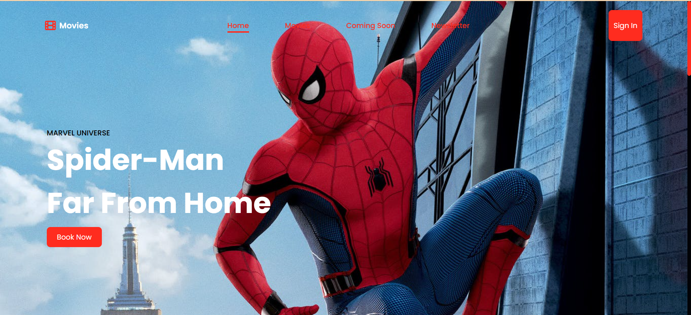
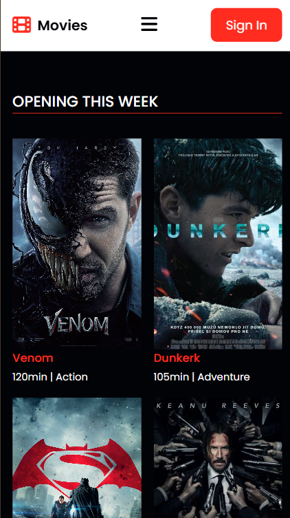
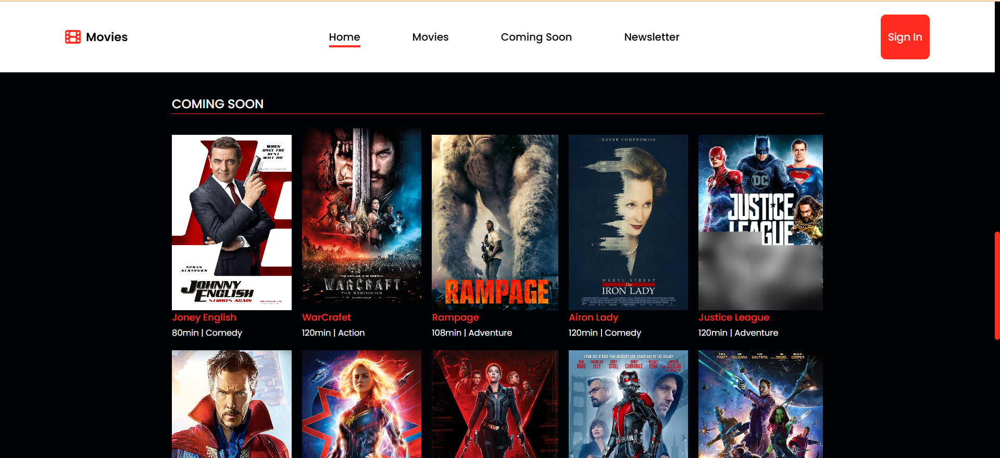

Rebuilding a UI Using a UI Framework

Task Description:
You have a UI project built using HTML and CSS only, and it
is fully responsive on all screen sizes. Your task is to rebuild
this project using any UI framework of your choice, such as
Bootstrap or Tailwind CSS, while maintaining the same
design and responsiveness.
Submission Requirements:
1. Rebuild the project using a UI framework instead of regular
CSS.
2. Ensure that the final design matches the original version
exactly in terms of appearance and responsiveness.
3. Upload the code to GitHub and share the repository link
Note: You may make slight improvements to the design if
necessary, but the main goal is to achieve the same result
using a UI framework instead of plain CSS.
Original project: <a href="https://drive.google.com/drive/folders/1Oe9jDkKbgR5pieTCD3VC8dIg_tyngZfM">[Project Link Here]</a>

Laptop Screen:

Mobile Screen:

Products:

